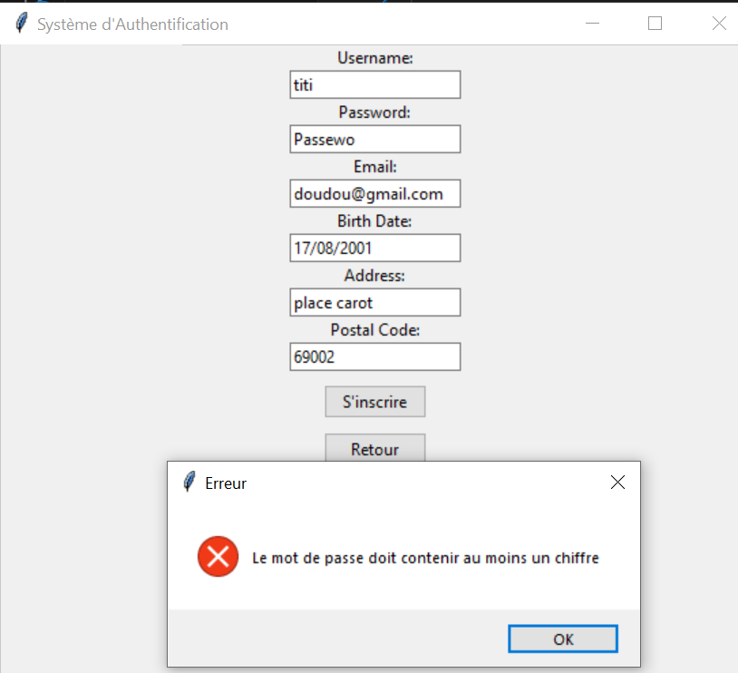

# Système d'Authentification à Deux Facteurs

## Description
Ce projet implémente un système d'authentification à deux facteurs en Python. Il comprend une interface graphique pour l'inscription et la connexion des utilisateurs, avec une vérification en deux étapes :
1. Authentification classique (nom d'utilisateur/mot de passe)
2. Question de sécurité basée sur les informations personnelles

## Structure du Projet
```
project/
├── main.py
├── README.md
├── reference.docx
├── .github/
│   └── workflows/
│       └── convert-readme.yml
├── docs/
│   └── images/
│       ├── inscription.png
│       ├── mot_de_passe_invalide.png
│       ├── connexion.png
│       ├── question_securite.png
│       ├── inscription_reussie.png
│       ├── blocage_compte.png
│       └── connexion_reussie.png
└── src/
    ├── __init__.py
    ├── database/
    │   ├── __init__.py
    │   └── database.py
    ├── gui/
    │   ├── __init__.py
    │   └── auth_gui.py
    └── utils/
        ├── __init__.py
        ├── auth_system.py
        └── security.py
```

## Prérequis
- Python 3.x
- tkinter (généralement inclus avec Python)
- SQLite3 (inclus avec Python)

## Installation
1. Clonez le repository
```bash
git clone https://github.com/mondiar01/Mise-en-place-d-un-OTP.git
```

2. Naviguez vers le dossier du projet
```bash
cd Mise-en-place-d-un-OTP
```

3. Lancez l'application
```bash
python main.py
```

## Fonctionnalités

### 1. Inscription
- Interface d'inscription avec les champs suivants :
  - Nom d'utilisateur
  - Mot de passe
  - Email
  - Date de naissance
  - Adresse
  - Code postal


### 2. Critères de Sécurité du Mot de Passe
Le mot de passe doit contenir :
- Au moins 8 caractères
- Au moins une majuscule
- Au moins un chiffre
- Au moins un caractère spécial (!@#$%^&*)



### 3. Connexion - Première Étape
- Authentification classique avec :
  - Nom d'utilisateur
  - Mot de passe
- Limite de 3 tentatives de connexion


### 4. Connexion - Deuxième Étape
- Question de sécurité aléatoire basée sur :
  - Code postal
  - Date de naissance
  - Email


## Mesures de Sécurité Implémentées
1. Hachage des mots de passe avec SHA-256
2. Protection contre les tentatives multiples (3 essais maximum)
3. Authentification à deux facteurs
4. Validation des données d'entrée
5. Stockage sécurisé dans une base de données SQLite

## Tests de Fonctionnalités

### Test d'Inscription
1. Lancement de l'application
2. Remplissage du formulaire d'inscription
3. Validation des critères du mot de passe


### Test de Connexion
1. Tentative avec identifiants corrects
2. Tentative avec mauvais mot de passe
3. Vérification du blocage après 3 tentatives


### Test de la Question de Sécurité
1. Connexion réussie
2. Réponse à la question de sécurité
3. Accès à l'application


## Structure de la Base de Données
Table `users` :
- id (INTEGER PRIMARY KEY)
- username (TEXT UNIQUE)
- password_hash (TEXT)
- email (TEXT)
- birth_date (TEXT)
- address (TEXT)
- postal_code (TEXT)
- login_attempts (INTEGER)

## GitHub Actions Workflow
```yaml
name: Convert README to Word
on:
  push:
    branches:
      - main
    paths:
      - 'README.md'
      - 'docs/images/**'

jobs:
  convert-readme:
    runs-on: ubuntu-latest
    
    steps:
      - uses: actions/checkout@v4
      
      - name: Install Pandoc and required packages
        run: |
          sudo apt-get update
          sudo apt-get install -y \
            pandoc \
            librsvg2-bin

      - name: Create output directories
        run: |
          mkdir -p output/word
          mkdir -p temp/images

      - name: Prepare README and images
        run: |
          # Copier le README
          cp README.md temp/
          
          # Copier les images
          cp -r docs/images/* temp/images/
          
          # Ajuster les chemins des images dans le README
          cd temp
          sed -i 's|docs/images/|images/|g' README.md

      - name: Create reference.docx
        run: |
          pandoc -o reference.docx --print-default-data-file reference.docx

      - name: Convert README to DOCX with images
        working-directory: temp
        run: |
          pandoc README.md \
            -f markdown \
            -t docx \
            --toc \
            --wrap=none \
            --reference-doc=../reference.docx \
            --extract-media=. \
            -o "../output/word/README.docx"

      - name: Upload Word document
        uses: actions/upload-artifact@v4
        with:
          name: readme-word
          path: output/word/README.docx
          retention-days: 30
```

## Contribution
Ce projet a été développé dans le cadre d'un exercice de sécurité informatique. Les contributions sont les bienvenues via pull requests.

## Améliorations Possibles
1. Ajout d'un système de récupération de mot de passe
2. Implémentation de la validation d'email
3. Ajout d'une authentification par email ou SMS (OTP)
4. Amélioration de l'interface utilisateur
5. Ajout de logs pour suivre les tentatives de connexion

## Auteur
Modou Ndiar DIA

## Licence
Ce projet est sous licence MIT. Voir le fichier LICENSE pour plus de détails.